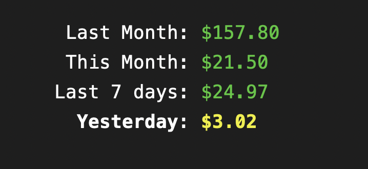

## aws-cost-cli
> CLI tool to perform cost analysis on your AWS account with Slack integration

## Installation

Install the package globally or alternatively you can also use `npx`

```bash
npm install -g infra-cost
```

## Usage

For the simple usage, just run the command without any options. 

```
aws-cost
```

The output will be a the totals with breakdown by service. Optionally, you can pass the following options to modify the output:

```bash
$ aws-cost --help

  Usage: aws-cost [options]

  A CLI tool to perform cost analysis on your AWS account

  Options:
    -V, --version                  output the version number

    -k, --access-key [key]         AWS access key
    -s, --secret-key [key]         AWS secret key
    -r, --region [region]          AWS region (default: us-east-1)

    -p, --profile [profile]        AWS profile to use (default: "default")

    -j, --json                     Get the output as JSON
    -u, --summary                  Get only the summary without service breakdown
    -t, --text                     Get the output as plain text (no colors / tables)

    -S, --slack-token [token]      Slack token for the slack message
    -C, --slack-channel [channel]  Slack channel to post the message to

    -v, --version                  Get the version of the CLI
    -h, --help                     Get the help of the CLI
```

In order to use the CLI you can either pass the AWS credentials through the options i.e.:

```bash
aws-cost -k [key] -s [secret] -r [region]
```

or if you have configured the credentials using [aws-cli](https://github.com/aws/aws-cli), you can simply run the following command:

```bash
aws-cost
```

To configure the credentials using aws-cli, have a look at the [aws-cli docs](https://github.com/aws/aws-cli#configuration) for more information.

## Detailed Breakdown
> The default usage is to get the cost breakdown by service

```bash
aws-cost
```
You will get the following output


## Total Costs
> You can also get the summary of the cost without the service breakdown

```bash
aws-cost --summary
```
You will get the following output



## Plain Text
> You can also get the output as plain text

```bash
aws-cost --text
```

<details>
  <summary>You will get the following output in response</summary>
  
```
Totals:
  Last Month: $157.80
  This Month: $21.50
  Last 7 Days: $24.97
  Yesterday: $3.02

Totals by Service:
  Last Month:
    Amazon Elastic Container Service for Kubernetes: $8.20
    Amazon Elastic Compute Cloud - Compute: $20.01
    Amazon Relational Database Service: $64.20
    Amazon Simple Notification Service: $0.00
    Amazon Elastic Load Balancing: $17.80
    Amazon Simple Storage Service: $0.05
    Amazon Virtual Private Cloud: $15.41
    Amazon Simple Queue Service: $0.00
    AWS Key Management Service: $0.11
    AWS Secrets Manager: $0.00
    AWS Cost Explorer: $0.01
    AmazonCloudWatch: $1.82
    Amazon DynamoDB: $0.00
    EC2 - Other: $7.43
    AWS Lambda: $0.00
    AWS Glue: $0.00
    Tax: $22.75

  This Month:
    Amazon Elastic Container Service for Kubernetes: $0.00
    Amazon Elastic Compute Cloud - Compute: $3.23
    Amazon Relational Database Service: $8.03
    Amazon Simple Notification Service: $0.00
    Amazon Elastic Load Balancing: $3.44
    Amazon Simple Storage Service: $0.01
    Amazon Virtual Private Cloud: $2.88
    Amazon Simple Queue Service: $0.00
    AWS Key Management Service: $0.00
    AWS Secrets Manager: $0.00
    AWS Cost Explorer: $0.00
    AmazonCloudWatch: $0.15
    Amazon DynamoDB: $0.00
    EC2 - Other: $0.65
    AWS Lambda: $0.00
    AWS Glue: $0.00
    Tax: $3.10

  Last 7 Days:
    Amazon Elastic Container Service for Kubernetes: $0.00
    Amazon Elastic Compute Cloud - Compute: $3.76
    Amazon Relational Database Service: $9.50
    Amazon Simple Notification Service: $0.00
    Amazon Elastic Load Balancing: $4.02
    Amazon Simple Storage Service: $0.01
    Amazon Virtual Private Cloud: $3.37
    Amazon Simple Queue Service: $0.00
    AWS Key Management Service: $0.00
    AWS Secrets Manager: $0.00
    AWS Cost Explorer: $0.00
    AmazonCloudWatch: $0.46
    Amazon DynamoDB: $0.00
    EC2 - Other: $0.76
    AWS Lambda: $0.00
    AWS Glue: $0.00
    Tax: $3.10

  Yesterday:
    Amazon Elastic Container Service for Kubernetes: $0.00
    Amazon Elastic Compute Cloud - Compute: $0.54
    Amazon Relational Database Service: $1.31
    Amazon Simple Notification Service: $0.00
    Amazon Elastic Load Balancing: $0.57
    Amazon Simple Storage Service: $0.00
    Amazon Virtual Private Cloud: $0.48
    Amazon Simple Queue Service: $0.00
    AWS Key Management Service: $0.00
    AWS Secrets Manager: $0.00
    AWS Cost Explorer: $0.00
    AmazonCloudWatch: $0.00
    Amazon DynamoDB: $0.00
    EC2 - Other: $0.11
    AWS Lambda: $0.00
    AWS Glue: $0.00
    Tax: $0.00
```
</details>

## JSON Output
> You can also get the output as JSON

```bash
aws-cost --json
```

<details>
  <summary>You will get the following output in response</summary>

```json
{
  "totals": {
    "lastMonth": 157.8016994008,
    "thisMonth": 21.499375037900002,
    "last7Days": 24.973976725800004,
    "yesterday": 3.0157072707
  },
  "totalsByService": {
    "lastMonth": {
      "AWS Key Management Service": 0.1136712728,
      "AWS Lambda": 0,
      "Amazon DynamoDB": 0,
      "EC2 - Other": 7.429695578699999,
      "Amazon Elastic Compute Cloud - Compute": 20.012435730400007,
      "Amazon Elastic Container Service for Kubernetes": 8.203354166999999,
      "Amazon Elastic Load Balancing": 17.8041212886,
      "Amazon Relational Database Service": 64.19798108490001,
      "Amazon Simple Storage Service": 0.05173824170000002,
      "Amazon Virtual Private Cloud": 15.410926380000006,
      "AmazonCloudWatch": 1.8165903879000003,
      "Tax": 22.75,
      "AWS Glue": 0,
      "Amazon Simple Notification Service": 0,
      "Amazon Simple Queue Service": 0,
      "AWS Secrets Manager": 0.0011852688,
      "AWS Cost Explorer": 0.01
    },
    "thisMonth": {
      "AWS Key Management Service": 0,
      "AWS Lambda": 0,
      "Amazon DynamoDB": 0,
      "EC2 - Other": 0.653115731,
      "Amazon Elastic Compute Cloud - Compute": 3.2255999999999996,
      "Amazon Elastic Container Service for Kubernetes": 0,
      "Amazon Elastic Load Balancing": 3.4436290893,
      "Amazon Relational Database Service": 8.0306438101,
      "Amazon Simple Storage Service": 0.0102726955,
      "Amazon Virtual Private Cloud": 2.881275,
      "AmazonCloudWatch": 0.154838712,
      "Tax": 3.1,
      "AWS Glue": 0,
      "Amazon Simple Notification Service": 0,
      "Amazon Simple Queue Service": 0,
      "AWS Secrets Manager": 0,
      "AWS Cost Explorer": 0
    },
    "last7Days": {
      "AWS Key Management Service": 0,
      "AWS Lambda": 0,
      "Amazon DynamoDB": 0,
      "EC2 - Other": 0.7554970696,
      "Amazon Elastic Compute Cloud - Compute": 3.7631999999999994,
      "Amazon Elastic Container Service for Kubernetes": 0,
      "Amazon Elastic Load Balancing": 4.0171728722,
      "Amazon Relational Database Service": 9.496635127500001,
      "Amazon Simple Storage Service": 0.0118860755,
      "Amazon Virtual Private Cloud": 3.365069445,
      "AmazonCloudWatch": 0.46451613599999997,
      "Tax": 3.1,
      "AWS Glue": 0,
      "Amazon Simple Notification Service": 0,
      "Amazon Simple Queue Service": 0,
      "AWS Secrets Manager": 0,
      "AWS Cost Explorer": 0
    },
    "yesterday": {
      "AWS Key Management Service": 0,
      "AWS Lambda": 0,
      "Amazon DynamoDB": 0,
      "EC2 - Other": 0.1094404603,
      "Amazon Elastic Compute Cloud - Compute": 0.5376,
      "Amazon Elastic Container Service for Kubernetes": 0,
      "Amazon Elastic Load Balancing": 0.5745390425,
      "Amazon Relational Database Service": 1.3124030765,
      "Amazon Simple Storage Service": 0.0017246914,
      "Amazon Virtual Private Cloud": 0.48,
      "AmazonCloudWatch": 0,
      "Tax": 0,
      "AWS Glue": 0,
      "Amazon Simple Notification Service": 0,
      "Amazon Simple Queue Service": 0,
      "AWS Secrets Manager": 0,
      "AWS Cost Explorer": 0
    }
  }
}
```
</details>

## Slack Integration

> You can also get the output as a slack message

You will need to create [a slack app](https://api.slack.com/apps?new_app=1), visit the **OAuth & Permissions** tab, and add the `chat:write` and `chat:write.public` scopes. Then create an OAuth token from the "OAuth Tokens" section and pass it to the CLI.

> **Note:** The `--slack-channel` is the [channel id](https://stackoverflow.com/questions/40940327/what-is-the-simplest-way-to-find-a-slack-team-id-and-a-channel-id#answer-44883343), not the name.

```bash
aws-cost --slack-token [token] --slack-channel [channel]
```

You will get the message on slack with the breakdown:

You can set up a GitHub [workflow similar to this](https://github.com/codecollab-co/infra-cost/blob/7549ceb2ba75b562e29f85ac53a9413c3e1f57ee/.github/workflows/aws-costs.yml#L1) which can send the daily cost breakdown to Slack.

## Note

Regarding the credentials, you need to have the following permissions in order to use the CLI:

```json
{
  "Version": "2012-10-17",
  "Statement": [
    {
      "Sid": "VisualEditor0",
      "Effect": "Allow",
      "Action": [
        "iam:ListAccountAliases",
        "ce:GetCostAndUsage"
      ],
      "Resource": "*"
    }
  ]
}
```

Also, please note that this tool uses AWS Cost Explorer under the hood which [costs $0.01 per request](https://aws.amazon.com/aws-cost-management/aws-cost-explorer/pricing/).

## License
MIT &copy; Code Collab
